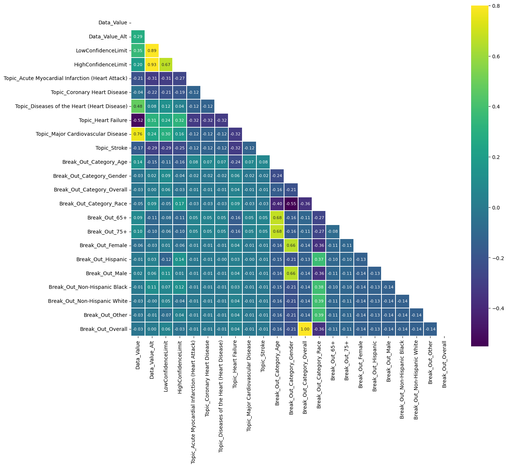

# Project 2: Cardiovascular Disease Prediction 

## Table of Contents

[Overview](#overview)

[Data Analysis](#data-analysis)

[Presentation](#presentation)

[The Team](#the-team)

## Project Overview

### Overview

The goal is to identify the most important factors in the development of cardiovascular disease in humans. This will be accomplished by gathering multiple datasets from unique studies including from Center of Disease Control Division for Heart Disease and Stroke Prevention (DHDSP)

### Questions we aim to answer

1. What are the most important features associated with heart disease?
1. What features are most correlated with one another?
1. How accurate can our machine learning models predict the presence of heart disease?

### Usage and installation instructions

#### Execution

1. Make sure all required libraries are installed by executing the below.

    pip install -U scikit-learn  
    pip install ipython  

    1. Ensure that the dependencies are installed to successfully import the below:

    import pandas as pd  
    import datetime as dt 
    import matplotlib.pyplot as plt 
    import numpy as np 
    from scipy.signal import correlate 

    import seaborn as sns 
    import math  
    import sklearn  
    import scipy.stats 

1. Open and run ADD_TBC_NOTEBOOK_HERE in a Jupyter Notebook or Jupyter Lab.

#### High-level logic contained in ADD_TBC_NOTEBOOK_HERE:

[monthly_analysis_2.ipynb](monthly_analysis_2.ipynb) is the main notebook for performing monthly time series analysis and forecasting.

1. Read the following CSV files from [./Resouces](./Resources/):

    ADD_TBC_CONTENT HERE

1. Data cleaning

    ADD_TBC_CONTENT HERE

1. Create correlation matrices for the different data sets to identify which features should be included in a model

    See [Analysis Findings #2](#findings) for details

1. Model Training and Predictions:

    ADD_TBC_CONTENT HERE

## Data Analysis

### Business Understanding

TBC

### Data Understanding

TBC

### Data Sources

Kaggle CVD data from CMS- [CMS](https://www.kaggle.com/code/sripadkarthik/heart-disease-prediction-using-ml-with-90-acc/input)

TBC - [TBC](TBC)

TBC - [TBC](TBC)

TBC - [TBC](TBC)

### Analysis

#### Findings

1. What are the most important features associated with heart disease?

    PLACEHOLDER_EXAMPLE_ONLY

1. What features are most correlated with one another?

    PLACEHOLDER_EXAMPLE_ONLY
    1. CMS CVD Data from Kaggle
    
        1. Data Value and Topic_Heart Failure  = -0.52
        1. Data Value and Topic_Major Cardiovascular Disease = 0.76
        1. Age and both 65+ and 75+ = 0.68
        1. Gender and both Female and Male = 0.66
        1. Data Value Alt and Low Confidence = 0.89
        1. Data Value Alt and High Confidence = 0.93
        1. Data Value and Topic_Diseases of the Heart (Heart Disease) = 0.48

1. How accurate can our machine learning models predict the presence of heart disease?
   PLACEHOLDER_EXAMPLE_ONLY
    1. CMS CVD Data from Kaggle
        1. If using the RandomForestClassifier model
            1. Accuracy: 0.92
            1. Precision: 0.92
            1. Recall: 0.91

#### Challenges

1. Unfamiliarity with the data and problem space.
1. The CMS CVD Data from Kaggle does not align well with the goal of targetubg individuals.

## Presentation

[HEART DISEASE FEATURE PREDICTION](https://docs.google.com/presentation/d/1rhJhO4PanKQYyzuQixS4IRH55oBq9r3lwv1lGGjAFo8/)

## The Team

[Laetitia5](https://github.com/Laetitia5)

[rjf7q](https://github.com/rjf7q)

[tamfree](https://github.com/tamfree)

[vinayakgrover](https://github.com/vinayakgrover)
